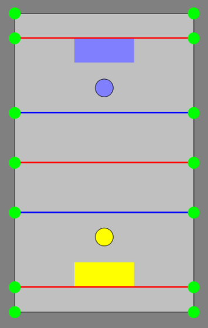

lkcpp
=======

This was a project for the course "Leistungskurs C++" during my electrical and computational engineering master at the Technical University Munich.

### Group Task
Make a Turtlebot play "hockey". Therefore he had to localize his self in the playground and then push 3 monochrome pins into a colored area on the other side of the field. During that he had to avoid the enemy robot, which had to do the same task just with the other color and started at the other side of the field.

We were 5 people and splitted the task into these topics:
* Kinect-progressing
* Lidar-progressing
* Localization
* Motioncontrol
* Pathplanning
* Gamelogic

### My contribution
I worked at the topics Localization and the Lidar-progessing.
We used an Augmented Monte Carlo Localization, and the features where extracted from the Lidar.

### The playground

To localize in the playground, we set the origin of the coordinates into one edge of the field. We used the 14 poles as landmarks and constructed a map with these.

### Demonstration Video

Visualization with rviz. 
Green Arrows: Green Poles (Landmarks)
Turquoise Arrows: Detected Features (Green Poles, Chairlegs,...) in respect to current estimated positon
Red Arrows: Position of Particle
Yellow Arrow: Estimated position

### Lidar-progressing
To extract the green poles the laserscan was checked for local minimas and checked if the width of them corresponds to the width of a pole. Therefore it detected the green poles as well as the pins and also chairlegs. We decided to use the laserscan for that task instead of the kinect as we had a 360 degree view and could find all the features. The problem that we detected more features (pins, chairlegs) was no problem, as the AMCL solves this problem.

### Localization
We designed the AMCL with 1000 particles and used gaussian distribution as described in [ProbabilisticRobotics](https://docs.ufpr.br/~danielsantos/ProbabilisticRobotics.pdf).

I worked on everything except the sample motion model and debugged the algorithm till it worked for our task. The actual position got calculated from all the particles with a modified k-mean algorithm (set k=1, if error to big, k=2 ...). 

#### Main Problems
Here are the main problems we ran into.

##### Not enough features
While working without the lidar we had a problem that we sometimes just found 1-2 features, which was a problem as long as the correct position wasn't found. This was solved by using the lidar.

##### No explicit position
As this field and the map is symmetric, there were always 2 possible positions with the given features. This was solved by detecting the side first depending on the colored field on the ground, then randomly distributing all particles in this side of field.

##### Getting stucked into a local maxima
This took quite a while, till I realized you have to add gaussian noise to all the particles choosen to overcome this problem, as otherwise it gets to sure about one position and never finds the global maxima.

### Improvment
The time-consumption can be improved by quite a lot. We got a localization every approximatly every second, which was sufficient for our task.
